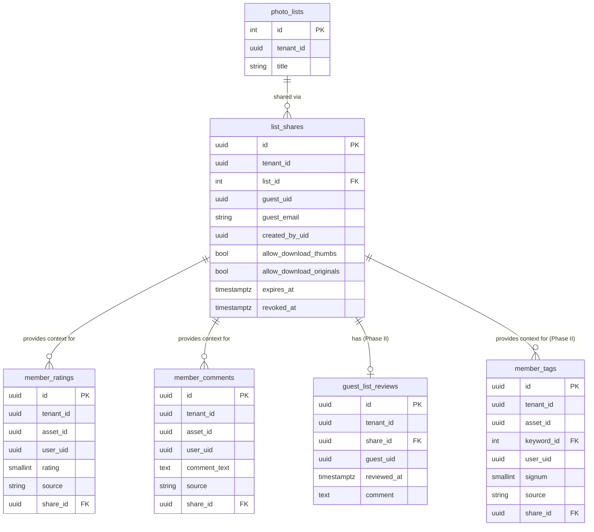

# Shared Lists Design

**Date**: 2026-02-19
**Status**: Draft
**Audience**: Backend and frontend implementers

---

## 0. Phases Overview

This feature is split into two independent delivery phases.

| Phase | Scope | Tables |
|-------|-------|--------|
| **Phase I** | Sharing, rating, commenting | `list_shares`, `member_comments`, `member_ratings` |
| **Phase II** | Member tagging + list review | `member_tags`, `guest_list_reviews` |

Phase I delivers the core guest workflow — share a list, guests rate and comment, owners see the feedback. Phase II adds structured tagging and the formal "mark as reviewed" mechanic.

---

## 1. Overview

Shared Lists is a collaboration feature that allows Zoltag users to share a curated `PhotoList` with external reviewers ("guests") via email. Guests authenticate via Supabase magic link (passwordless email OTP) — no password required. Once authenticated, guests see a limited view of the shared list and can rate and comment on individual images. Regular users can see all guest feedback from the normal Zoltag interface, and an administrative panel surfaces annotation counts across all shared lists.

**Key decision**: Guests are real Supabase users with a `guest` role stored in `app_metadata`. This reuses the existing Supabase auth infrastructure (JWT validation, session management, token refresh) rather than requiring a custom token system. The only difference from regular users is their role and the constraints that come with it.

---

## 2. User Roles and Authentication

### 2.1 Roles

| Role | Description |
|------|-------------|
| `super_admin` | System-wide administrator |
| `admin` | Tenant administrator |
| `editor` | Power user within a tenant |
| `user` | Standard tenant user |
| `guest` *(new)* | External reviewer — access limited to explicitly shared lists |

All roles authenticate via Supabase JWT. The `user_role` claim is injected into the JWT via a Supabase Custom Access Token Hook (see 2.3).

### 2.2 Guest Authentication Flow

1. Regular user shares a list with `guest@example.com` via `POST /api/v1/lists/{id}/shares`.
2. Backend calls `supabase.auth.admin.inviteUserByEmail('guest@example.com')` (server-side, using the `service_role` key).
   - If the guest does not yet have a Supabase account, one is created automatically.
   - Supabase sends an invite email with a magic link.
3. Backend reads the guest's current `app_metadata` and appends the new `tenant_id` to the `tenant_ids` array (creating it if this is the guest's first invite), then calls `supabase.auth.admin.updateUserById(user_id, { app_metadata: { role: 'guest', tenant_ids: [...existing, '<tenant_id>'] } })`.
4. Guest clicks the magic link → Supabase redirects to `/guest?token=...` (configured as the `redirectTo` URL).
5. Frontend exchanges the token via the normal Supabase PKCE flow → receives a standard Supabase JWT with `user_role: 'guest'` and `tenant_ids` claims.
6. All subsequent API calls use the standard `Authorization: Bearer <jwt>` header plus the existing `X-Tenant-ID` header to identify which tenant the request is for.
7. Backend authorization checks: `user_role == 'guest'` AND `X-Tenant-ID` is in the JWT's `tenant_ids` array AND an active `list_shares` row exists for `(list_id, guest_uid)`.

**Re-authentication**: After their session expires, guests request a new magic link via `POST /api/v1/guest/auth/request-link` (public endpoint, email required). This calls `supabase.auth.admin.generateLink()` server-side and emails the link. No password is ever needed. The same Supabase account is reused regardless of which tenant triggered the re-auth.

**Open question (Q2)**: What is the Supabase session TTL for guests? Supabase default is 1 hour access token + refresh token. Should refresh tokens be disabled for guests (force re-auth via magic link after session expires) or allowed (seamless long-lived sessions)? Default assumption: allow refresh tokens; same as regular users.

### 2.3 Custom Access Token Hook

A Postgres function is registered as a Supabase Custom Access Token Hook. It reads `app_metadata.role` and injects it as `user_role` in the JWT, along with `tenant_id`:

```sql
CREATE OR REPLACE FUNCTION public.custom_access_token_hook(event jsonb)
RETURNS jsonb
LANGUAGE plpgsql
AS $$
DECLARE
  claims jsonb;
BEGIN
  claims := event -> 'claims';
  claims := jsonb_set(claims, '{user_role}',
    COALESCE(event -> 'claims' -> 'app_metadata' -> 'role', '"user"'));
  claims := jsonb_set(claims, '{tenant_ids}',
    COALESCE(event -> 'claims' -> 'app_metadata' -> 'tenant_ids', '[]'));
  RETURN jsonb_set(event, '{claims}', claims);
END;
$$;
```

This hook must be enabled in the Supabase dashboard under Authentication → Hooks → Custom Access Token.

The existing `get_current_user` dependency in the backend already validates the Supabase JWT. It should be extended to expose `user_role` and `tenant_id` from the JWT claims for use in authorization checks.

---

## 3. Data Model

All new tables follow project conventions: `UUID` primary keys, `tenant_id UUID` on all tenant-scoped tables, `created_at` / `updated_at` timestamps.

### 3.1 Phase I Tables

#### `list_shares`

One row per (list, guest) pair. Links a Supabase guest user to a shared list.

```sql
CREATE TABLE list_shares (
    id                       UUID PRIMARY KEY DEFAULT gen_random_uuid(),
    tenant_id                UUID NOT NULL REFERENCES tenants(id) ON DELETE CASCADE,
    list_id                  INTEGER NOT NULL REFERENCES photo_lists(id) ON DELETE CASCADE,
    guest_uid                UUID NOT NULL,   -- Supabase auth.users.id of the guest
    guest_email              VARCHAR(255) NOT NULL,  -- denormalized for display
    created_by_uid           UUID NOT NULL,   -- Supabase auth.users.id of inviting user
    allow_download_thumbs    BOOLEAN NOT NULL DEFAULT FALSE,
    allow_download_originals BOOLEAN NOT NULL DEFAULT FALSE,
    expires_at               TIMESTAMPTZ,    -- NULL = never expires
    created_at               TIMESTAMPTZ NOT NULL DEFAULT NOW(),
    revoked_at               TIMESTAMPTZ,    -- NULL = active; non-NULL = revoked
    UNIQUE (list_id, guest_uid)
);

CREATE INDEX idx_list_shares_tenant    ON list_shares(tenant_id);
CREATE INDEX idx_list_shares_list      ON list_shares(list_id);
CREATE INDEX idx_list_shares_guest_uid ON list_shares(guest_uid);
```

**Notes**:
- `guest_uid` is the Supabase `auth.users.id` UUID. This is the canonical identity reference.
- `guest_email` is denormalized for display purposes only.
- `expires_at` is set by the inviting user at share creation time. UI presents four options — 7 days, 30 days, 90 days, or Never — which map to `NOW() + INTERVAL` or `NULL`. The backend enforces expiry on every guest request: a share where `expires_at IS NOT NULL AND expires_at < NOW()` is treated as inactive (equivalent to revoked). The guest receives `403`.
- `revoked_at` is set rather than deleting rows, so guest annotations remain queryable after revocation. See Q7.
- A share is **active** when `revoked_at IS NULL AND (expires_at IS NULL OR expires_at > NOW())`.

**Open question (Q3)**: Should `allow_download_originals` require an `admin` role to grant, or can any list editor grant it? Default: any list editor.

#### `member_comments`

Free-text comments left by any user on individual assets.

```sql
CREATE TABLE member_comments (
    id           UUID PRIMARY KEY DEFAULT gen_random_uuid(),
    tenant_id    UUID NOT NULL REFERENCES tenants(id) ON DELETE CASCADE,
    asset_id     UUID NOT NULL,   -- references assets.id; no FK to avoid cross-schema coupling
    user_uid     UUID NOT NULL,   -- Supabase auth.users.id
    comment_text TEXT NOT NULL,
    source       VARCHAR(20) NOT NULL DEFAULT 'user',  -- 'user', 'guest'
    share_id     UUID REFERENCES list_shares(id) ON DELETE SET NULL,  -- optional share context
    created_at   TIMESTAMPTZ NOT NULL DEFAULT NOW(),
    updated_at   TIMESTAMPTZ NOT NULL DEFAULT NOW()
);

CREATE INDEX idx_member_comments_tenant  ON member_comments(tenant_id);
CREATE INDEX idx_member_comments_asset   ON member_comments(asset_id);
CREATE INDEX idx_member_comments_user    ON member_comments(user_uid);
CREATE INDEX idx_member_comments_share   ON member_comments(share_id);
```

**Notes**:
- Named `member_comments` (not `image_comments`) because assets can be images, videos, or other file types.
- Free text, no vocabulary constraint.
- Multiple comments per user per asset are allowed (append-only).
- Any user (guest, user, admin) can comment.

#### `member_ratings`

Per-user ratings (1–5) on individual assets.

```sql
CREATE TABLE member_ratings (
    id          UUID PRIMARY KEY DEFAULT gen_random_uuid(),
    tenant_id   UUID NOT NULL REFERENCES tenants(id) ON DELETE CASCADE,
    asset_id    UUID NOT NULL,   -- references assets.id; no FK to avoid cross-schema coupling
    user_uid    UUID NOT NULL,   -- Supabase auth.users.id
    rating      SMALLINT NOT NULL CHECK (rating BETWEEN 1 AND 5),
    source      VARCHAR(20) NOT NULL DEFAULT 'user',  -- 'user', 'guest'
    share_id    UUID REFERENCES list_shares(id) ON DELETE SET NULL,  -- optional share context
    created_at  TIMESTAMPTZ NOT NULL DEFAULT NOW(),
    updated_at  TIMESTAMPTZ NOT NULL DEFAULT NOW(),
    UNIQUE (asset_id, user_uid)   -- one rating per user per asset
);

CREATE INDEX idx_member_ratings_tenant ON member_ratings(tenant_id);
CREATE INDEX idx_member_ratings_asset  ON member_ratings(asset_id);
CREATE INDEX idx_member_ratings_user   ON member_ratings(user_uid);
CREATE INDEX idx_member_ratings_share  ON member_ratings(share_id);
```

**Notes**:
- **Conflict model**: `member_ratings` are independent of `image_metadata.rating` (the editorial/permatag-equivalent rating). The editorial rating always takes precedence for sorting/filtering purposes. Member ratings are surfaced as a separate signal.
- **Display model (Option C)**: ratings are NOT averaged. Instead they are surfaced as a count signal: "X of Y reviewers rated this 4+" or similar. No mean is computed or displayed.
- `share_id` context allows querying ratings scoped to a specific guest review share vs. all member reactions on the asset.
- Upsert semantics: one rating per user per asset (the UNIQUE constraint). Updating replaces the previous value.

### 3.2 Phase II Tables

#### `guest_list_reviews` *(Phase II)*

A guest marking an entire shared list as reviewed.

```sql
CREATE TABLE guest_list_reviews (
    id           UUID PRIMARY KEY DEFAULT gen_random_uuid(),
    tenant_id    UUID NOT NULL REFERENCES tenants(id) ON DELETE CASCADE,
    share_id     UUID NOT NULL REFERENCES list_shares(id) ON DELETE CASCADE,
    guest_uid    UUID NOT NULL,
    reviewed_at  TIMESTAMPTZ NOT NULL DEFAULT NOW(),
    comment      TEXT,
    UNIQUE (share_id, guest_uid)
);

CREATE INDEX idx_guest_list_reviews_tenant ON guest_list_reviews(tenant_id);
CREATE INDEX idx_guest_list_reviews_share  ON guest_list_reviews(share_id);
```

#### `member_tags` *(Phase II)*

Tag signals applied by any user (guest, user, admin) to assets using the tenant's controlled vocabulary or free-form text.

```sql
CREATE TABLE member_tags (
    id          UUID PRIMARY KEY DEFAULT gen_random_uuid(),
    tenant_id   UUID NOT NULL REFERENCES tenants(id) ON DELETE CASCADE,
    asset_id    UUID NOT NULL,
    keyword_id  INTEGER REFERENCES keywords(id) ON DELETE CASCADE,  -- NULL for freetext tags
    tag_text    VARCHAR(255),                                        -- NULL for canonical tags
    user_uid    UUID NOT NULL,
    signum      SMALLINT NOT NULL CHECK (signum IN (-1, 1)),
    source      VARCHAR(20) NOT NULL DEFAULT 'user',
    share_id    UUID REFERENCES list_shares(id) ON DELETE SET NULL,
    created_at  TIMESTAMPTZ NOT NULL DEFAULT NOW(),
    -- Exactly one of keyword_id or tag_text must be set
    CONSTRAINT member_tags_keyword_or_text CHECK (
        (keyword_id IS NOT NULL AND tag_text IS NULL) OR
        (keyword_id IS NULL AND tag_text IS NOT NULL)
    )
);

CREATE INDEX idx_member_tags_tenant     ON member_tags(tenant_id);
CREATE INDEX idx_member_tags_asset      ON member_tags(asset_id);
CREATE INDEX idx_member_tags_keyword    ON member_tags(keyword_id) WHERE keyword_id IS NOT NULL;
CREATE INDEX idx_member_tags_user       ON member_tags(user_uid);
CREATE INDEX idx_member_tags_share      ON member_tags(share_id);

-- One canonical tag per user per asset per keyword
CREATE UNIQUE INDEX uq_member_tags_canonical
    ON member_tags(asset_id, keyword_id, user_uid)
    WHERE keyword_id IS NOT NULL;

-- One freetext tag per user per asset per normalized text
CREATE UNIQUE INDEX uq_member_tags_freetext
    ON member_tags(asset_id, lower(tag_text), user_uid)
    WHERE tag_text IS NOT NULL;
```

**Notes**:
- A tag row holds either a canonical `keyword_id` (from the tenant's controlled vocabulary) or a free-text `tag_text` string — never both, never neither. The `member_tags_keyword_or_text` CHECK constraint enforces this.
- Free-text `tag_text` values are normalized to lowercase and trimmed on write.
- When free-text tags are harvested and promoted to the controlled vocabulary, existing `member_tags` rows can be updated in-place: set `keyword_id` to the new keyword's id and set `tag_text = NULL`. The CHECK constraint and partial unique indexes accommodate this transition cleanly.
- `permatags` always win on conflict: if a permatag exists for an asset+keyword, `member_tags` entries for the same keyword are treated as supporting signals only, never overriding.
- `share_id` is optional context — allows querying "which tags did guests on this share apply?" separately from all member tags on the asset.
- Promotion rules (e.g. auto-promote to permatag at N votes) are deferred to a future version.
- Any user (guest, user, admin) can write member_tags. Admin tagging mode/context TBD.

### 3.3 Modifications to Existing Tables

#### `photo_lists`

No schema changes required for v1.

**Open question (Q6)**: Should a list with at least one active `list_shares` row show a "shared" badge in the UI? Default: yes.

### 3.4 Relationship Diagram



---

## 4. API Design

### 4.1 Authentication Middleware

Because guests are real Supabase users, **no new authentication middleware is needed**. The existing `get_current_user` dependency validates the JWT for all users. Guest-specific authorization is enforced at the route level by checking `user_role == 'guest'` from the JWT claims and verifying the guest has an active `list_shares` row for the requested list.

### 4.2 Regular User Endpoints (require Supabase JWT, role ≠ `guest`)

#### `POST /api/v1/lists/{list_id}/shares`

Share a list with one or more email addresses.

**Request body**:
```json
{
  "emails": ["alice@example.com", "bob@example.com"],
  "allow_download_thumbs": false,
  "allow_download_originals": false,
  "expires_in_days": 30
}
```

`expires_in_days` accepts `7`, `30`, `90`, or `null` (never). The backend converts this to an absolute `expires_at` timestamp (`NOW() + INTERVAL '<n> days'`) before storing. Defaults to `30` if omitted.

**Behavior**:
- Validates the list belongs to the current tenant and the calling user can edit it.
- For each email:
  - Calls `supabase.auth.admin.inviteUserByEmail(email, { redirectTo: '<app>/guest' })` server-side.
  - Sets `app_metadata: { role: 'guest', tenant_id: '<tenant_id>' }` on the created user.
  - Creates or reactivates a `list_shares` row (`revoked_at = NULL`).
- Returns the created/updated share rows.

**Response** `201`: Array of `list_shares` rows.

**Errors**: `403` if user cannot edit the list; `404` if list not found.

---

#### `GET /api/v1/lists/{list_id}/shares`

List all active shares for a list.

**Response** `200`: Array of active `list_shares` rows.

---

#### `PATCH /api/v1/lists/{list_id}/shares/{share_id}`

Update per-share download permissions.

**Request body**: `{ "allow_download_thumbs": true, "allow_download_originals": false, "expires_in_days": 90 }`

`expires_in_days` recalculates `expires_at` from `NOW()`. Pass `null` to remove expiry (never expires).

---

#### `DELETE /api/v1/lists/{list_id}/shares/{share_id}`

Revoke a share. Sets `revoked_at = NOW()`. Does not delete comments or reactions.

**Open question (Q7)**: After revocation, should the guest's annotations remain visible to regular users? Default: yes (soft-delete only).

---

#### `GET /api/v1/lists/{list_id}/shares/{share_id}/annotations`

All guest feedback for a specific share, grouped by asset. Aggregates data from `member_comments` and `member_ratings` where `share_id` matches.

**Response** `200`:
```json
{
  "share_id": "uuid",
  "guest_email": "alice@example.com",
  "annotations": [
    {
      "asset_id": "uuid",
      "reaction": {
        "rating": 4,
        "updated_at": "2026-02-19T11:30:00Z"
      },
      "comments": [
        { "id": "uuid", "comment_text": "Love the lighting here.", "created_at": "2026-02-19T11:28:00Z" }
      ]
    }
  ]
}
```

---

#### `GET /api/v1/lists/shares/summary`

Administrative overview: all lists with shares, per-guest review status, annotation counts. Scoped to current tenant.

**Response** `200`:
```json
[
  {
    "list_id": 42,
    "list_title": "Spring Campaign Review",
    "shares": [
      {
        "share_id": "uuid",
        "guest_email": "alice@example.com",
        "annotation_count": 14
      }
    ]
  }
]
```

---

#### `POST /api/v1/lists/{list_id}/shares/{share_id}/download/thumbs`
#### `POST /api/v1/lists/{list_id}/shares/{share_id}/download/originals`

Trigger zip generation for the list (admin-initiated, bypasses per-share download flags).

**Open question (Q8)**: Async job (preferred for large lists) or synchronous? Default: async via existing workflow queue. Define polling/webhook mechanism before implementation.

---

### 4.3 Guest Endpoints — Phase I (require Supabase JWT, role = `guest`)

Guest endpoints live under `/api/v1/guest/`. Authorization checks that `user_role == 'guest'` AND an active `list_shares` row exists for `(list_id, guest_uid)`. A share is active when `revoked_at IS NULL AND (expires_at IS NULL OR expires_at > NOW())`. Expired shares return `403` with a body indicating the link has expired, so the frontend can show a human-readable message rather than a generic error.

#### `GET /api/v1/guest/lists/{list_id}`

Fetch list metadata and items. Returns same shape as the regular list items endpoint, including thumbnail URLs.

---

#### `POST /api/v1/guest/lists/{list_id}/comments`

Submit a comment on an asset. Writes to `member_comments`.

**Request body**:
```json
{ "asset_id": "uuid", "comment_text": "Slightly out of focus." }
```

**Behavior**:
- Validates `asset_id` is in the shared list.
- Inserts a new row (multiple comments per user per asset are allowed).
- Sets `share_id` and `source = 'guest'` for context.

**Errors**: `403` if asset not in list; `400` if `comment_text` is empty.

---

#### `POST /api/v1/guest/lists/{list_id}/reactions`

Submit or update a rating on an asset. Writes to `member_ratings`.

**Request body**:
```json
{ "asset_id": "uuid", "rating": 4 }
```

**Behavior**:
- Validates `asset_id` is in the shared list.
- Upserts: one rating per (asset, user). Updating replaces the previous value (UNIQUE constraint on `(asset_id, user_uid)` enforced at DB level).
- Sets `share_id` and `source = 'guest'` for context.

**Errors**: `403` if asset not in list; `400` if `rating` is out of range (must be 1–5).

---

#### `DELETE /api/v1/guest/lists/{list_id}/comments/{comment_id}`

Delete one of the guest's own comments from `member_comments`. Cannot delete other guests' comments.

---

#### `GET /api/v1/guest/lists/{list_id}/my-reactions`

All comments and ratings the calling guest has submitted for this list. Aggregates from `member_comments` and `member_ratings` for the current `guest_uid`. Used to pre-populate the UI on return visits.

**Response** `200`:
```json
{
  "comments": [
    { "id": "uuid", "asset_id": "uuid", "comment_text": "Love the lighting here.", "created_at": "2026-02-19T11:28:00Z" }
  ],
  "reactions": [
    { "id": "uuid", "asset_id": "uuid", "rating": 4, "updated_at": "2026-02-19T11:30:00Z" }
  ]
}
```

**Open question (Q9)**: Can guests see other guests' annotations? Default: no — each guest sees only their own.

---

#### `POST /api/v1/guest/lists/{list_id}/download/thumbs`
#### `POST /api/v1/guest/lists/{list_id}/download/originals`

Trigger zip download. Returns `403` if the corresponding `allow_download_*` flag is `FALSE` on the share.

---

#### `POST /api/v1/guest/auth/request-link` *(public — no JWT required)*

Re-send a magic link to an existing guest email. Calls `supabase.auth.admin.generateLink()` server-side.

**Request body**: `{ "email": "guest@example.com" }`

Always returns `200` regardless of whether the email exists (prevents user enumeration). Rate-limited server-side.

**Open question (Q10)**: Rate limit parameters — default: 3 requests per email per hour.

---

### 4.4 Guest Endpoints — Phase II *(member_tags + list review)*

#### `POST /api/v1/guest/lists/{list_id}/review`

Mark the list as reviewed.

**Request body**: `{ "comment": "Optional review comment." }`

Upserts a `guest_list_reviews` row for `(share_id, guest_uid)`.

---

#### `POST /api/v1/guest/lists/{list_id}/tags`

Submit a tag on an asset. Writes to `member_tags`.

**Request body**:
```json
{ "asset_id": "uuid", "keyword_id": 12, "signum": 1 }
```

**Behavior**:
- Validates `asset_id` is in the shared list (prevents blind asset enumeration).
- Validates `keyword_id` exists in the tenant's controlled vocabulary.
- Upserts: one tag signal per (asset, keyword, user). `signum` of `-1` removes/negates the tag; `1` applies it.
- Sets `share_id` to the active share for context.

**Errors**: `403` if asset not in list; `404` if `keyword_id` not found in tenant vocabulary; `400` for invalid `signum`.

---

#### `DELETE /api/v1/guest/lists/{list_id}/tags/{tag_id}`

Delete one of the guest's own tags from `member_tags`. Cannot delete other guests' tags.

---

## 5. Frontend and UX Flow

### 5.1 Regular User — Sharing a List

1. A "Share" button appears in the list header (owner and tenant admins only).
2. Opens a `share-list-modal.js` component with:
   - Multi-email input (comma or newline separated).
   - "Allow thumbnail download" and "Allow full-size download" checkboxes.
   - "Link expires" selector: **7 days / 30 days / 90 days / Never** (default: 30 days).
   - "Send invite" button.
3. On submit, calls `POST /api/v1/lists/{list_id}/shares`.
4. Modal updates to show active shares with expiry date (or "Never") and a "Revoke" button per share.

### 5.2 Regular User — Viewing Guest Feedback

**In image detail modal**: A "Collaborator Feedback" section appears when guest annotations exist for that asset. Shows each guest's email, star rating, and comments. Guest annotations are visually distinct (different color or "Guest" label). Ratings are displayed as a count signal ("X of Y reviewers rated this 4+"), not as an average.

**Admin Reviews panel**: New sub-tab or route (`/admin/reviews`) renders `GET /api/v1/lists/shares/summary`. Shows all shared lists and annotation counts per share. Clicking a row expands to show full annotation detail. *(Phase II: per-guest review status once `guest_list_reviews` is available.)*

### 5.3 Guest View

**Route**: `/guest` (top-level, separate from the main authenticated app)

The guest authenticates via the standard Supabase magic link flow — the frontend handles this the same way it handles regular user login (Supabase JS client). After authentication, the JWT contains `user_role: 'guest'` and the frontend routes to the guest view rather than the normal app.

#### Guest List View (`guest-list-view.js`)

1. **Header**: List title, "You have been invited to review this collection", guest email for confirmation.
2. **Image grid**: Thumbnail grid of list items. No navigation to the rest of the app.
3. **Per-image annotation**: On hover/tap, shows rating stars and comment icon. Clicking opens an annotation drawer.
4. **Annotation drawer** (`guest-annotation-drawer.js`):
   - Star rating (1–5, pre-filled if already rated). Submits to `POST .../reactions`.
   - Comment text area with Submit. Submits to `POST .../comments`.
   - *(Phase II)* Tag selector (controlled vocabulary from tenant keywords, adds on selection). Submits to `POST .../tags`.
5. *(Phase II)* **Review bar**: "Mark as Reviewed" button with optional comment. Always available (no minimum interaction gate — see Q11).
6. **Download buttons**: Shown only if `allow_download_thumbs` or `allow_download_originals` is true for this share.

**Open question (Q11)**: *(Phase II)* Gate "Mark as Reviewed" on minimum interaction, or always available? Default: always available.

---

## 6. Open Questions

| # | Question | Default assumption |
|---|----------|--------------------|
| Q1 | Single tenant per guest account, or multi-tenant? | **Decided**: `tenant_ids` array in `app_metadata`; one account per email regardless of how many tenants invite them |
| Q2 | Supabase refresh tokens for guests — allow or disable? | Allow (same as regular users) |
| Q3 | Who can grant `allow_download_originals`? | Any list editor |
| Q4 | Unique rating constraint at DB or API layer? | **Decided**: UNIQUE constraint at DB level on `(asset_id, user_uid)` in `member_ratings`; API uses upsert semantics |
| Q5 | Normalize guest tag text? Validate against vocabulary? | **Decided (Phase II)**: tags use canonical `keyword_id` OR normalized free-text `tag_text`; the `member_tags_keyword_or_text` CHECK constraint enforces exactly one is set; free-text is lowercased and trimmed on write |
| Q6 | Show "shared" badge on list cards with active shares? | Yes |
| Q7 | Retain guest annotations after share is revoked? | Yes (soft-delete share only) |
| Q8 | Zip download: async job or synchronous? | Async via existing workflow queue |
| Q9 | Can guests see other guests' annotations? | No |
| Q10 | Rate limit on magic link re-request? | 3 requests per email per hour |
| Q11 | Gate "Mark as Reviewed" on minimum interaction? | No gate |
| Q12 | Admin tagging context — when an admin applies a `member_tag`, should it carry higher weight or lower the auto-promote threshold? | Deferred; no special admin behavior in v1 (Phase II) |
| Q13 | Harvesting workflow — how are freetext tags reviewed and promoted to keywords? | Default: admin UI showing freetext tag frequency, with a one-click "add to vocabulary and backfill" action. Deferred to Phase II. |

---

## 7. Out of Scope for v1

- **Guest display names**: Email is the display identifier.
- **Cross-guest annotation visibility**: Guests see only their own annotations.
- **Guest notifications**: No "list updated" emails after the initial invite.
- **Member tag promotion to permatags**: Auto-promotion rules (e.g. N-vote threshold) deferred to Phase II / future version.
- **Rating aggregation/averaging**: Not implemented; ratings are displayed as a count signal only (e.g. "X of Y reviewers rated this 4+").
- **Download zip UI**: Backend worker task defined; progress polling UI is a fast-follow.
- **Multi-tenant guest accounts**: One Supabase account per tenant per guest email.
- **Audit log**: Guest auth events not written to audit log in v1.
- **Tenant-configurable guest permissions**: Only download flags configurable in v1.

---

## 8. Implementation Plan

### 8.1 Phase I: Sharing, Rating, Commenting

#### Backend

1. **Supabase Custom Access Token Hook**: Create the Postgres function and enable it in the dashboard. Update `get_current_user` to expose `user_role` and `tenant_id` from JWT claims.
2. **Alembic migration**: Create `list_shares`, `member_comments`, `member_ratings` tables and indexes.
3. **SQLAlchemy models**:
   - `src/zoltag/models/sharing.py` — `ListShare`
   - `src/zoltag/models/reactions.py` — `MemberComment`, `MemberRating`
4. **Routers**:
   - `src/zoltag/routers/sharing.py` — regular user endpoints
   - `src/zoltag/routers/guest.py` — guest endpoints (comments, ratings, download)
   - Register both in `src/zoltag/api.py`

#### Frontend

New components:
- `frontend/components/share-list-modal.js`
- `frontend/components/guest-app.js`
- `frontend/components/guest-list-view.js`
- `frontend/components/guest-annotation-drawer.js`
- `frontend/components/admin-reviews-panel.js`

The guest route (`/guest`) must be accessible without the normal authenticated layout. The Supabase JS client handles the token exchange from the magic link URL hash — this is the same flow as the existing login page.

### 8.2 Phase II: Member Tags + List Review

#### Backend

1. **Alembic migration**: Create `guest_list_reviews` and `member_tags` tables and indexes (depends on `list_shares` existing from Phase I).
2. **SQLAlchemy models**:
   - Add `GuestListReview` to `src/zoltag/models/sharing.py`
   - Add `MemberTag` to `src/zoltag/models/reactions.py`
3. **Router additions**:
   - Add review endpoint to `src/zoltag/routers/guest.py` (`POST /review`)
   - Add tag endpoints to `src/zoltag/routers/guest.py` (`POST /tags`, `DELETE /tags/{tag_id}`)
   - Add admin tag management and harvesting endpoints to `src/zoltag/routers/sharing.py`

#### Frontend

- Extend `guest-annotation-drawer.js` with the tag selector UI.
- Add "Mark as Reviewed" bar to `guest-list-view.js`.
- Extend `admin-reviews-panel.js` to show per-guest review status.
- Add admin harvesting panel (freetext tag frequency view with promote-to-vocabulary action).
